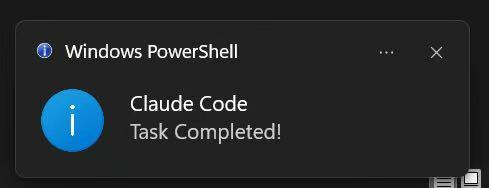
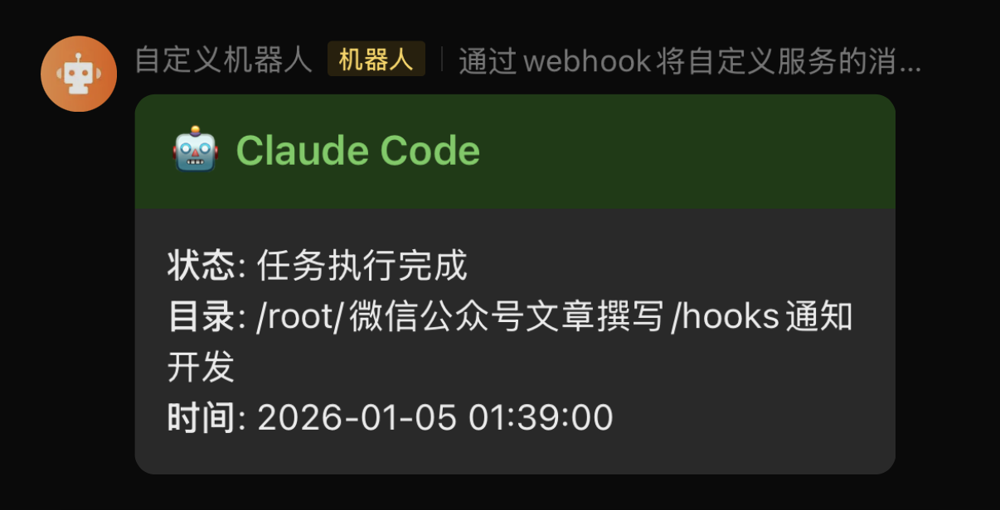

# Claude Code Hooks - 任务完成自动通知

**Automatic Notification System for Claude Code Task Completion**

让 Claude Code 在完成任务后自动发送通知提醒你，支持本地桌面通知和飞书推送。


## 功能特点

- ✅ **本地通知**：Linux/macOS/Windows 桌面弹窗提醒
- ✅ **飞书推送**：远程服务器工作时的移动端通知
- ✅ **开箱即用**：Hooks 是 Claude Code 内置功能，无需安装插件
- ✅ **简单配置**：仅需修改配置文件即可启用

## 效果展示

### Windows 桌面通知


### 飞书消息通知


## 快速开始

### 1. 安装脚本

```bash
# 复制脚本到 Claude Code 配置目录
cp notify.sh ~/.claude/notify.sh

# 添加执行权限
chmod +x ~/.claude/notify.sh
```

### 2. 配置飞书机器人（可选）

如果你想接收飞书通知：

1. 打开飞书，进入一个群聊（或新建一个）
2. 点击群设置 → 群机器人 → 添加机器人
3. 选择「自定义机器人」，设置名称
4. 复制生成的 Webhook 地址
5. 编辑 `~/.claude/notify.sh`，填入 Webhook：

```bash
FEISHU_WEBHOOK="https://open.feishu.cn/open-apis/bot/v2/hook/your-webhook-url"
```

### 3. 配置 Claude Code Hooks

编辑 `~/.claude/settings.json`，添加以下配置：

```json
{
  "hooks": {
    "Stop": [
      {
        "matcher": "",
        "hooks": [
          {
            "type": "command",
            "command": "/your/home/dir/.claude/notify.sh" // Windows版本填写："powershell.exe -ExecutionPolicy Bypass -File \"C:\\Users\\admin\\.claude\\notify.ps1\""（配置完需要删掉注释）
          }
        ]
      }
    ]
  }
}
```

**配置说明：**
- `"Stop"` — 在 Claude 完成响应时触发
- `"matcher": ""` — 空字符串表示所有情况都触发
- `"command"` — 脚本的**绝对路径**（使用 `~/.claude/notify.sh` 的绝对路径）

**获取绝对路径：**
```bash
echo ~/.claude/notify.sh
# 输出：/root/.claude/notify.sh
```

### 4. 重启 Claude Code

配置完成后，重启 Claude Code 即可生效。

### 5. 测试效果

随便问 Claude Code 一个问题，当它回复完成后，你应该能收到通知！

## 支持的通知方式

### Linux

使用 `notify-send` 发送桌面通知。

```bash
# 安装（Ubuntu/Debian）
sudo apt-get install libnotify-bin
```

### macOS

支持 `terminal-notifier` 或 `osascript`。

```bash
# 安装 terminal-notifier（可选）
brew install terminal-notifier
```

### Windows

通过 PowerShell 发送 Toast 通知（支持 WSL/Git Bash）。

### 飞书

发送富文本卡片消息，包含：
- 通知标题
- 执行状态
- 当前工作目录
- 完成时间

## 自定义配置

### 修改通知内容

编辑 `notify.sh` 中的配置区域：

```bash
TITLE="Claude Code"
MESSAGE="任务执行完成"
```

### 添加更多通知渠道

在 `notify.sh` 中添加新的函数，例如：

```bash
send_telegram_notification() {
    # 你的 Telegram Bot 逻辑
    curl -X POST "https://api.telegram.org/bot$TOKEN/sendMessage" \
        -d "chat_id=$CHAT_ID" \
        -d "text=$MESSAGE"
}

# 在脚本末尾调用
send_telegram_notification
```

## 常见问题

### Q: Hook 脚本执行失败怎么办？

A: 使用 `claude --debug` 启动，查看详细的 Hook 执行日志。

### Q: 修改配置后不生效？

A: Hooks 在启动时加载。修改后需重启 Claude Code，或使用 `/hooks` 命令重新加载。

### Q: 本地通知没有弹出？

A: 检查系统是否安装了通知工具：
- Linux: `notify-send`
- macOS: `terminal-notifier` 或 `osascript`
- Windows: PowerShell

### Q: 飞书通知收不到？

A: 检查：
1. Webhook URL 是否正确
2. 飞书机器人是否被禁用
3. 网络连接是否正常

## 更多 Hooks 创意

除了任务完成通知，你还可以实现：

### 危险命令拦截

```json
{
  "hooks": {
    "PreToolUse": [
      {
        "matcher": "Bash",
        "hooks": [
          {
            "type": "command",
            "command": "/path/to/safety-check.sh"
          }
        ]
      }
    ]
  }
}
```

### 自动代码格式化

```json
{
  "hooks": {
    "PostToolUse": [
      {
        "matcher": "Write|Edit",
        "hooks": [
          {
            "type": "command",
            "command": "prettier --write ."
          }
        ]
      }
    ]
  }
}
```

### 会话日志记录

```json
{
  "hooks": {
    "SessionStart": [
      {
        "matcher": "startup",
        "hooks": [
          {
            "type": "command",
            "command": "echo \"$(date): 新会话\" >> ~/.claude/session.log"
          }
        ]
      }
    ]
  }
}
```

## Claude Code Hooks 事件类型

| 事件名称 | 触发时机 | 典型用途 |
|---------|---------|---------|
| **SessionStart** | 会话启动或恢复时 | 加载配置、初始化环境 |
| **UserPromptSubmit** | 用户提交问题时 | 注入上下文、记录日志 |
| **PreToolUse** | 工具执行前 | 拦截危险操作、审批确认 |
| **PermissionRequest** | 需要用户授权时 | 自动审批或拒绝 |
| **PostToolUse** | 工具执行后 | 记录操作、触发后续任务 |
| **Notification** | 发送通知时 | 自定义通知渠道 |
| **Stop** | Claude 完成响应时 | **发送完成通知** ⭐ |
| **SubagentStop** | 子代理完成时 | 监控子任务状态 |
| **PreCompact** | 压缩上下文前 | 保存重要信息 |

---

## 🔗 相关工具

如果你对 Claude Code 开发感兴趣，推荐查看以下项目：

### WeChat Article Skills - 微信公众号文章工具集
一套完整的微信公众号内容创作工具，包括：
- **AI 写作助手** - 智能生成高质量技术文章
- **文章格式化** - Markdown 转微信排版
- **草稿发布** - 自动发布到微信后台

[📦 查看项目](https://github.com/BND-1/wechat_article_skills)

> 💡 本通知工具与微信工具集配合使用，可实现文章发布后的自动通知提醒！

---

## 参考资料

- [Claude Code Hooks 官方文档](https://code.claude.com/docs/en/hooks)
- [飞书自定义机器人文档](https://open.feishu.cn/document/ukTMukTMukTM/uUTNz4SN1MjL1UzM)
- [Claude Code 完全上手指南](https://www.kdjingpai.com/en/claude-code-wanquanba/)

---

## 📝 示例文章

使用本工具和其他 Claude Code 技巧创作的精选文章：

### 技术文章示例

1. **[Claude Code 零基础指南：不会写代码也能做开发？看这一篇就够了，效率翻倍！](https://mp.weixin.qq.com/s/Dx-XYcj74c2LdZOWwNS7GQ)**  

2. **[从70分钟到9分钟：微信公众号自动化Skills！提效狂魔！](https://mp.weixin.qq.com/s/iBKgEX_vfYNIe90qPi03Sw)**  

3. **[从 Chat 到 Agent：Claude Agent SDK 才是 AI 真正的生产力开关](https://mp.weixin.qq.com/s/58nZuLJGNjm6hqfGzJg-ZA)**  

4. **[Claude Skill：为什么它会取代 Dify、n8n 和 Coze？](https://mp.weixin.qq.com/s/rXl4nLI6ouJMIMfvL1iSbQ)**  

> 💡 **提示**：以上文章均使用 Claude Code 和相关工具完成创作，欢迎参考学习！

---

## 📱 关注公众号

扫描下方二维码关注我的微信公众号，获取更多 Claude Code 和 AI 开发技巧：


> 👆 **关注公众号** - 第一时间获取最新文章和工具更新

---

## 🤝 关于作者

### 联系方式

#### 添加个人微信
扫描下方二维码添加作者微信，交流使用心得：


> 👆 **添加微信** - 疑问解答、技术交流，拉你入群

---

#### 加入技术交流群
扫描下方二维码加入微信群，与更多开发者交流：


> 👆 **加入群聊** - 技术讨论、问题解答、交流讨论

---

#### 赞赏支持
如果这个项目对你有帮助，欢迎赞赏支持：


> 👆 **赞赏支持** - 您的支持是我最大的动力

---

## 📄 许可证

MIT License - 供个人和商业使用

---

## 🙏 致谢

感谢 Claude Code 团队提供的强大 Hooks 功能！

---

**祝你使用愉快！** 🎉

如有问题或建议，欢迎通过上方二维码联系我！
